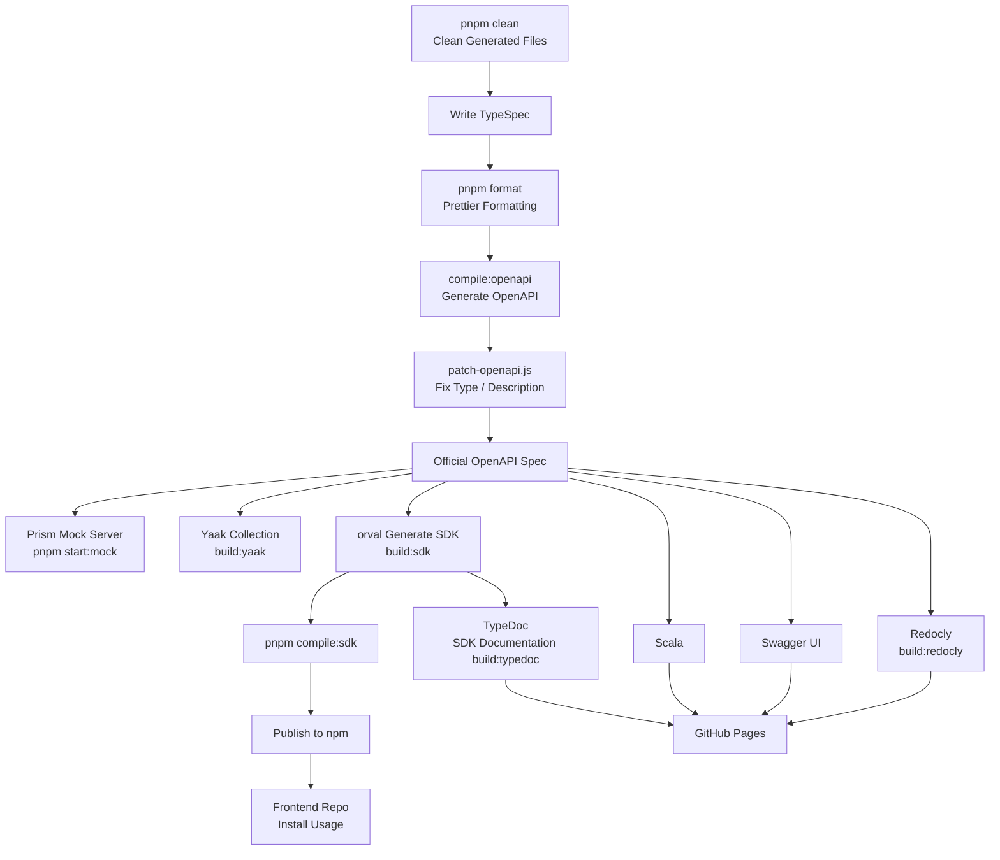

# Core System API

[](https://github.com/NYCU-SDC/core-system-api/actions/workflows/test.yml) [](https://github.com/NYCU-SDC/core-system-api/actions/workflows/sdk.yml) [](https://www.npmjs.com/package/@nycu-sdc/core-system-sdk)

Core System API defined using TypeSpec.



## Dependencies

Please install [Node.js](https://nodejs.org/) and [pnpm](https://pnpm.io/) first.

pnpm installation:

```bash
npm install --global corepack@latest
corepack enable pnpm
```

## Install Packages

```bash
pnpm i --dev
```

> If you wanna build website and sdk, use `pnpm i` instead.

## Available Commands

### Format TypeSpec Files

```bash
pnpm format
```

Formats all TypeSpec (`.tsp`) files in the project.

### Compile OpenAPI Specification

```bash
pnpm compile:openapi
```

Compiles TypeSpec files to OpenAPI specification and applies patches. Output will be in `tsp-output/schema/openapi.1.0.0.yaml`.

### Build Yaak Collection

```bash
pnpm build:yaak
```

Generates Yaak API collection from the OpenAPI specification.

> **Note:** You must run `pnpm compile:openapi` before building Yaak collection.

### Build SDK

```bash
pnpm build:sdk
```

Generates the SDK client code from the OpenAPI specification using Orval.

> **Note:** You must run `pnpm compile:openapi` and install with `pnpm i` before building the SDK.

### Compile SDK Package

```bash
pnpm compile:sdk
```

Compiles the SDK TypeScript package (`@nycu-sdc/core-system-sdk`).

> **Note:** You must run `pnpm build:sdk` and install with `pnpm i` before compiling the SDK package.

### Full SDK Build Sequence

To build the SDK from scratch, run these commands in order:

```bash
pnpm compile:openapi
pnpm build:sdk
pnpm compile:sdk
```

### Start Mock Server

```bash
pnpm start:mock
```

Starts a Prism mock server on `http://0.0.0.0:4010` using the compiled OpenAPI specification.

> **Note:** You must run `pnpm compile:openapi` and install with `pnpm i` before starting the mock server.

### Build Documentation

```bash
pnpm build:redocly
```

Builds static HTML documentation using Redocly. Output will be in `website/index.html`.

> **Note:** You must run `pnpm compile:openapi` and install with `pnpm i` before building documentation.

### Build TypeDoc

```bash
pnpm build:typedoc
```

Generates TypeDoc documentation for the SDK. Output will be in `website/sdk`.

> **Note:** You must run `pnpm compile:sdk` and install with `pnpm i` before building TypeDoc.

### Clean Generated Files

```bash
pnpm clean
```

Removes all generated files including `tsp-output`, `yaak`, and SDK generated code.

## Output Files

### API Specification

The compiled OpenAPI specification will be in `tsp-output/schema/openapi.1.0.0.yaml`.

### Preview Tools

- **Scalar** - Open [website/index.html](https://nycu-sdc.github.io/core-system-api/) in your browser
- **Swagger UI** - Open [website/swagger.html](https://nycu-sdc.github.io/core-system-api/swagger.html) in your browser
- **Redoc** - Open [website/sdk/index.html](https://nycu-sdc.github.io/core-system-api/sdk) in your browser
- **Prism Mock Server** - Run `pnpm start:mock` and visit <http://localhost:4010>
- **Yaak** - Import the `yaak` folder into [Yaak](https://yaak.app/)

## SDK Package

The SDK is published as `@nycu-sdc/core-system-sdk` and located in `packages/sdk`.

### Publishing the SDK

```bash
git checkout main
git pull
git tag v1.0.0
git push origin v1.0.0
```

Publishing is handled automatically via CI/CD when a new tag is pushed.
